# AWS IoT Printer Anomaly Detection System

A serverless, event-driven application that monitors printer telemetry in real time using AWS managed services. Printers publish metrics over MQTT to AWS IoT Core. The system automatically detects anomalies, tracks device health in DynamoDB, and sends instant alerts via Amazon SNS.

---

## Architecture

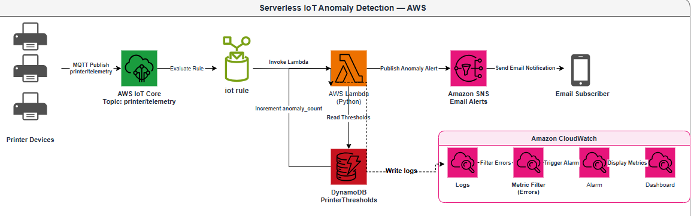
*Serverless IoT anomaly detection pipeline on AWS*

---

## AWS Services Used

| Service | Role |
|---|---|
| AWS IoT Core | Managed MQTT broker — receives printer telemetry |
| IoT Rules | SQL-based message routing to Lambda |
| AWS Lambda (Python) | Anomaly detection logic |
| Amazon DynamoDB | Per-printer thresholds and anomaly counts |
| Amazon SNS | Real-time email/SMS alert delivery |
| Amazon CloudWatch | Logs, metrics, alarms, and dashboard |

---

## How It Works

1. A printer publishes telemetry (temperature, workload) to the MQTT topic `printer/telemetry`
2. An IoT Rule listens on that topic and forwards every message to Lambda
3. Lambda reads the printer's thresholds from DynamoDB
4. If any value is out of range, Lambda increments the anomaly counter and publishes an alert to SNS
5. SNS delivers the alert to all subscribers via email
6. CloudWatch captures logs, tracks error metrics, and fires alarms if Lambda fails

---

## Setup & Configuration

### IoT Core — Thing & Certificate

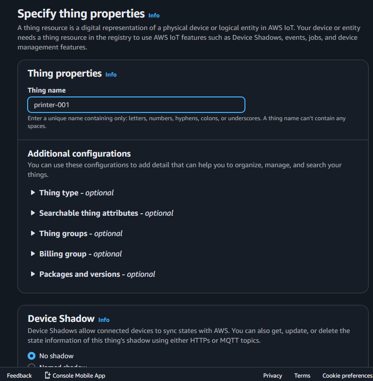
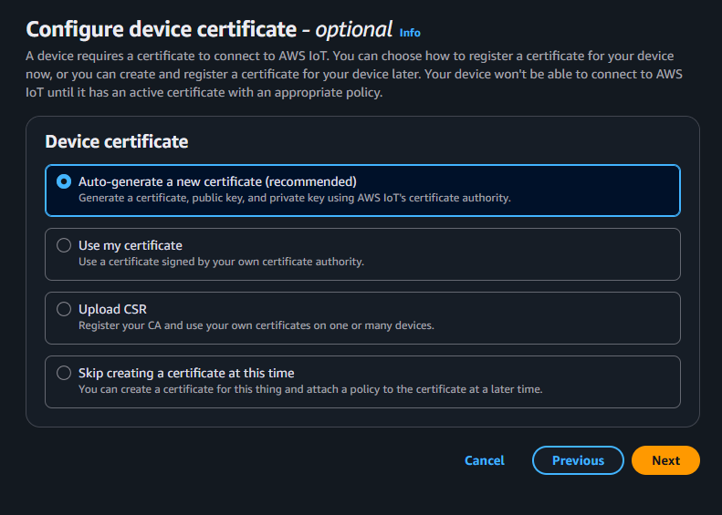

*IoT Thing representing printer-001 with active certificate*

Each printer is registered as an IoT **Thing** in AWS IoT Core with a unique X.509 certificate for mutual TLS authentication. A policy grants the device permission to connect and publish.

### IoT Core — Rule

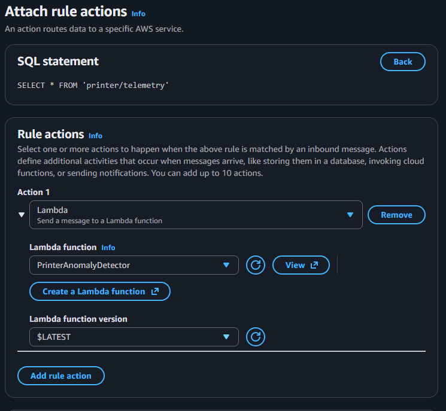

*IoT Rule routing telemetry topic to Lambda function*

The rule uses a simple SQL statement to capture all messages on the telemetry topic:

```sql
SELECT * FROM 'printer/telemetry'
```

### DynamoDB — Printer Thresholds

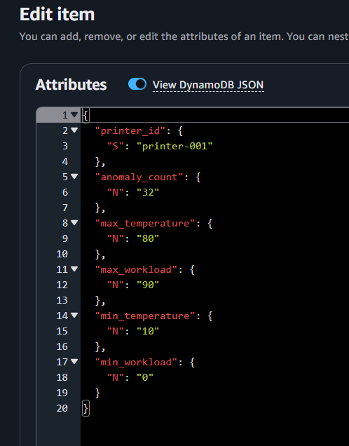

*Per-printer thresholds and anomaly count stored in DynamoDB*

Each printer has one row in the `PrinterThresholds` table:

```json
{
  "printer_id": "printer-001",
  "max_temperature": 80,
  "min_temperature": 10,
  "max_workload": 90,
  "min_workload": 0,
  "anomaly_count": 0
}
```

### Lambda — Anomaly Detection Logic

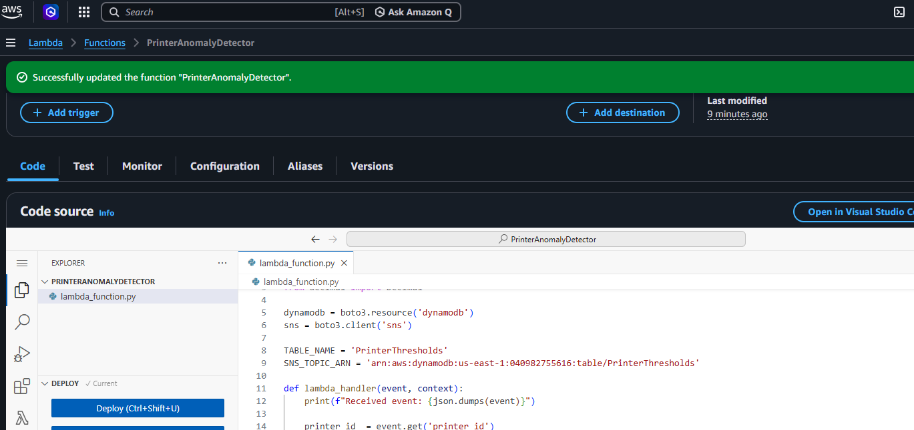

*Python Lambda function performing anomaly detection logic*

The function:
- Reads thresholds from DynamoDB using the `printer_id` from the MQTT payload
- Compares temperature and workload against min/max bounds
- Increments `anomaly_count` atomically on a detected anomaly
- Publishes a formatted alert message to SNS

---

## Observability

### Lambda Execution Metrics

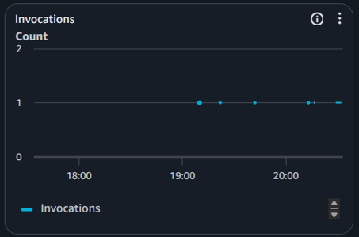

*Lambda execution metrics — invocations and duration*

### CloudWatch Logs

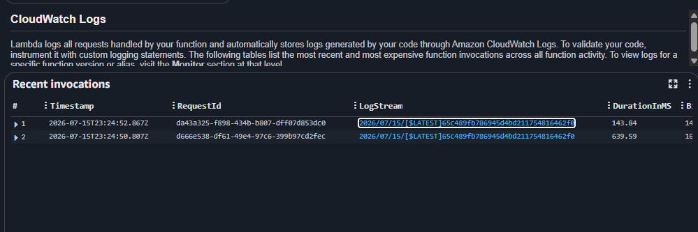
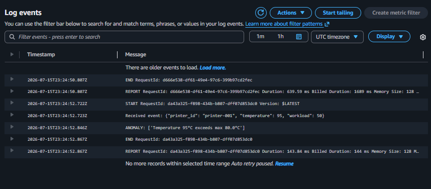

*CloudWatch logs showing detected anomaly for printer-001*

### Monitoring Dashboard

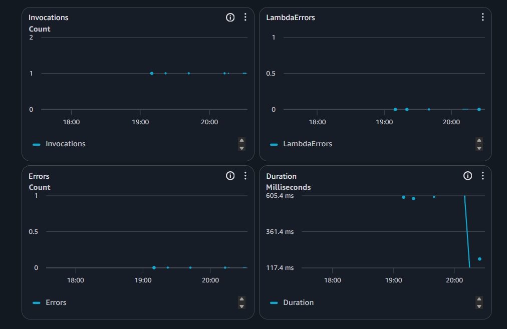

*Real-time monitoring dashboard for the printer anomaly system*

### Error Alarm

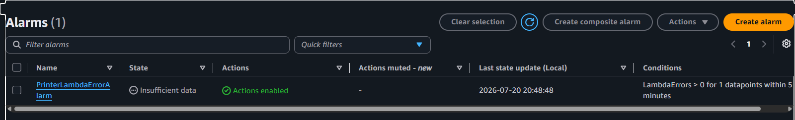

*CloudWatch alarm triggers SNS notification on Lambda errors*

The alarm fires when `LambdaErrors > 0` within any 5-minute window, sending an immediate notification via the same SNS topic.

---

## Alert Output

### SNS Email Alert

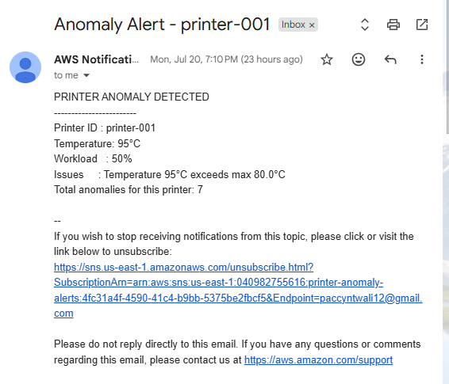

*SNS email alert triggered by out-of-range printer telemetry*

Sample alert message:

```
PRINTER ANOMALY DETECTED
------------------------
Printer ID : printer-001
Temperature: 95°C
Workload   : 50%
Issues     : Temperature 95°C exceeds max 80°C
Total anomalies for this printer: 1
```

### MQTT Test Client

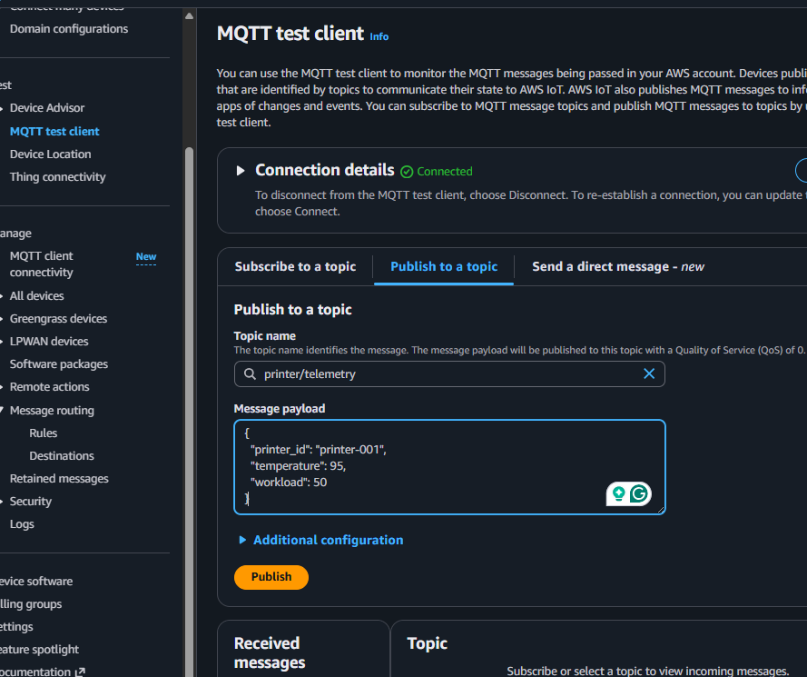

*Simulating printer telemetry via IoT Core MQTT test client*

Telemetry is simulated using the IoT Core built-in MQTT test client, publishing to `printer/telemetry`:

```json
{
  "printer_id": "printer-001",
  "temperature": 95,
  "workload": 50
}
```

---

## Project Structure

```
├── lambda_function.py         # Lambda anomaly detection code
├── printer-anomaly-diagram.html  # Interactive architecture diagram
├── README.md
└── screenshots/
    ├── 01-architecture-diagram.png
    ├── 02-iot-thing.png
    ├── 03-iot-rule.png
    ├── 04-dynamodb-table.png
    ├── 05-lambda-code.png
    ├── 06-lambda-monitor.png
    ├── 07-cloudwatch-logs.png
    ├── 08-cloudwatch-dashboard.png
    ├── 09-cloudwatch-alarm.png
    ├── 10-sns-email.png
    └── 11-mqtt-test-client.png
```

---

## Key Concepts Demonstrated

- **Event-driven architecture** — every component reacts to events, nothing is polling
- **Serverless compute** — Lambda scales to zero when idle, no servers to manage
- **IoT device authentication** — X.509 certificates for mutual TLS
- **NoSQL data modeling** — single-table design with partition key per device
- **Pub/sub messaging** — SNS fan-out for decoupled alert delivery
- **Observability** — structured logging, custom metrics, and alarms in CloudWatch

---

## Author
Pacifique Ntwali, 
Built as part of a cloud portfolio to demonstrate serverless IoT architecture on AWS.
